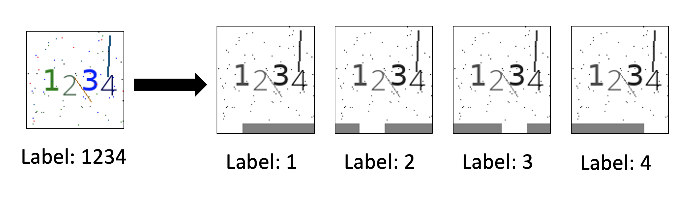
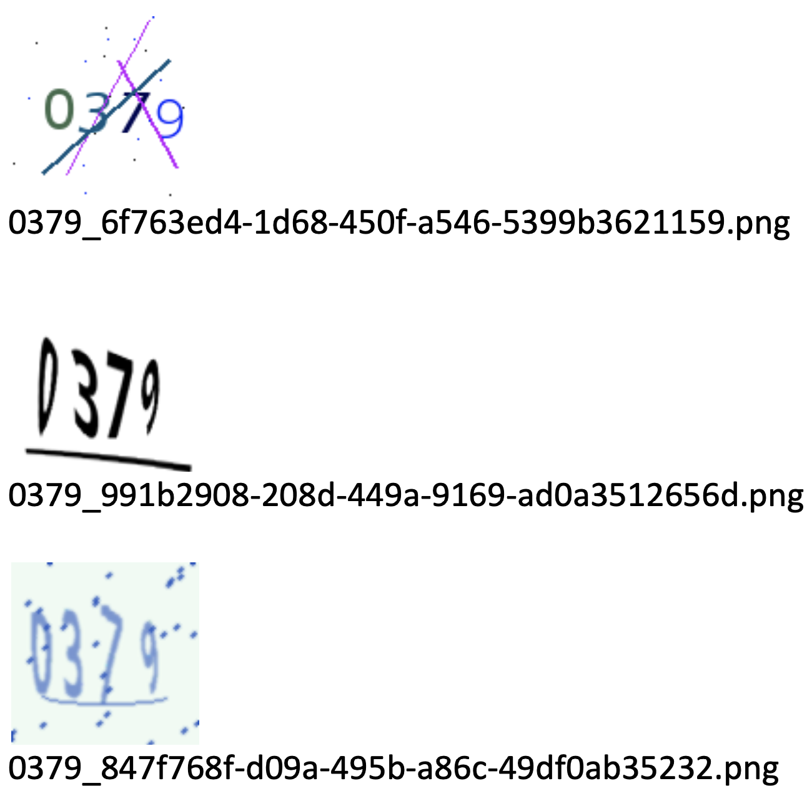

# DeCRUEHD  Framework

**D**eep **C**APTCHA **R**ecognition **U**sing **E**ncapsulated Preprocessing and **H**eterogeneous **D**atasets

A research effort for using Deep Learning (DL) techniques to recognize text-based CAPTCHAs. 

### Research Contributions:
1. The capability to generate 'Heterogeneous' CAPTCHA image samples, whereby different CAPTCHA schemes are employed to create a diversified labelled dataset.
2. Integrating the CRABI algorithm (**C**APTCHA **R**ecognition with **A**ttached **B**inary **I**mages) to preprocess CAPTCHA samples by attaching black and white bars as markers to the bottom of CAPTCHA image copies. This allows for CAPTCHA-text recognition on a per-character basis without the use of segmentation. 
3. Demonstrating the effectiveness of this CAPTCHA-recognition pipeline through transfer (continuous) learning. This project uses Convolutional Neural Networks (CNNs) to recognize characters in CAPTCHA images.



---
## Requirements
- Python 3.9
- Python 'pip' package manager
- Jupyter Notebook
- Python modules found in **requirements.txt** file

## Example Training Workflow
New users are recommended to execute the following command for a sample workflow:

```
$ python3 run.py
```

This script will create a heterogeneous CAPTCHA dataset and will train a CNN using the MobileNet architecture.

## Generate Dataset

```
$ python3 create_captcha_images.py
usage: create_captcha_images.py [-h] -i ITERATIONS -l {1,2,3,4,5} -t {SIMPLE,COMPLEX,MONOCHROME} -d DESTINATION

options:
  -h, --help            show this help message and exit
  -i ITERATIONS, --iterations ITERATIONS
                        The number of times to repeat unique CAPTCHA set generation.
  -l {1,2,3,4,5}, --length {1,2,3,4,5}
                        Number of characters for each CAPTCHA image.
  -t {SIMPLE,COMPLEX,MONOCHROME}, --captcha_type {SIMPLE,COMPLEX,MONOCHROME}
                        Variation of CAPTCHA image to create.
  -d DESTINATION, --destination DESTINATION
                        The name of the destination directory within "datasets" to save the CAPTCHA images to
```

Some CAPTCHA image samples:


## Train the Model

```
$ python3 create_captcha_recognition_model.py
usage: create_captcha_recognition_model.py [-h] -d DATA_DIRECTORY -l {1,2,3,4,5} -e EPOCHS -b {1,16,32,64,128} -a {VGG16,MOBILE-NET,RESNET,T-NET} -m MODEL_NAME -t
                                           TRAINING_HISTORY_FILE_NAME

options:
  -h, --help            show this help message and exit
  -d DATA_DIRECTORY, --data_directory DATA_DIRECTORY
                        Name of the sub-directory inside "datasets" holding the CAPTCHA images for training.
  -l {1,2,3,4,5}, --length {1,2,3,4,5}
                        Number of characters for each CAPTCHA image.
  -e EPOCHS, --epochs EPOCHS
                        Number of epochs when training the model.
  -b {1,16,32,64,128}, --batch_size {1,16,32,64,128}
                        Number of samples for the model at each iteration of training.
  -a {VGG16,MOBILE-NET,RESNET,T-NET}, --model_architecture {VGG16,MOBILE-NET,RESNET,T-NET}
                        Type of neural network architecture for the model.
  -m MODEL_NAME, --model_name MODEL_NAME
                        Name of the model file when saving to disk.
  -t TRAINING_HISTORY_FILE_NAME, --training_history_file_name TRAINING_HISTORY_FILE_NAME
                        Name of the destination file name for storing training history information.
```

## Model inference
Examples of Jupyter notebook files with model inference can be found in the **notebooks** subdirectory. 

The notebook files contain 'evaluation' in their file names.
